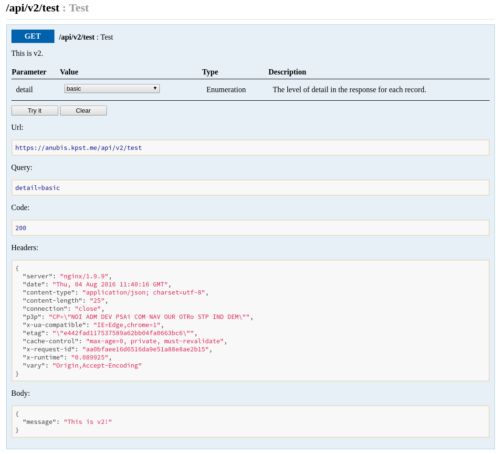
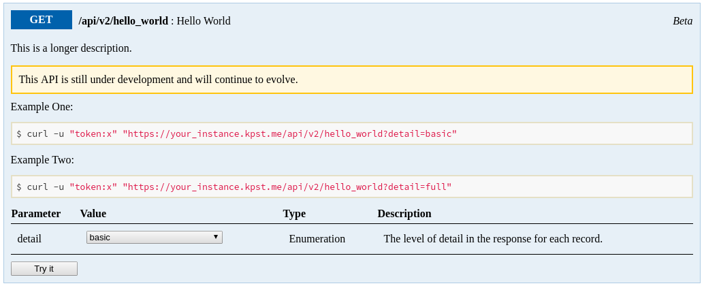
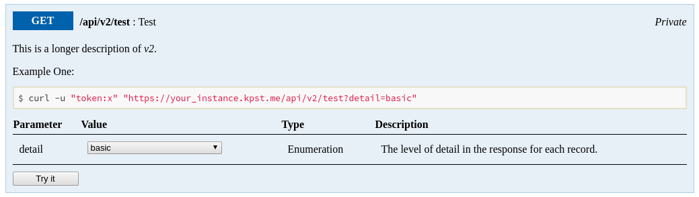

CabbageDoc
==========
A lean and mean *interactive API* documentation generator.



Getting Started
---------------
CabbageDoc has been designed from the ground-up to be easy to configure and use.

Start by adding the gem to your `Gemfile`.

```
gem 'cabbage_doc'
```

#### Configuration
Before using CabbageDoc, it is necessary to configure a couple of basic settings.

```ruby
CabbageDoc.configure do |config|
  config.root = Rails.root.join('doc')

  config.domain = 'example.com'

  config.authentication = proc do |auth, request|
    auth.type = :basic
    auth.username = request.params[:username]
    auth.password = request.params[:password]
    auth.configurable = [:username, :password]
  end

  config.controllers = proc do
    Dir.glob(Rails.root.join('app', 'controllers', 'api', 'v1', '*.rb')).sort
  end

  config.title = "Developer Documentation"
  config.welcome = <<-WELCOME
  Developer Documentation
  =======================
  Awesome developer documentation.
WELCOME
end
```

#### Task
Create a new `.rake` file in your project, usually within `lib/tasks` and add the following line:

```ruby
CabbageDoc::Task.define do |config|
  config.name = :cabbagedoc
end
```

Run `rake -T` to see the newly defined rake tasks.

#### Web
The default UI is a mountable Sinatra application. It's perfectly fine to mount
it within a Rails application, namely `config/routes.rb`.

```ruby
mount CabbageDoc::Web, at: '/docs'
```

If you don't want your documentation to be public, fear not, CabbageDoc got you covered:

```ruby
CabbageDoc::Web.use(Rack::Auth::Basic) do |username, password|
  username == 'cabbage' && password == 'doc'
end
```

By default, the documentation used by the UI is regenerated only by running the *documentation generation* rake task.

This behavior can be changed by setting the `dev` property to `true` in the configuration block.

```ruby
CabbageDoc.configure do |config|
  config.dev = Rails.env.development?
end
```

When *dev* is set to *true*, the documentation will be regenerated on each request.

#### Customize
If you do not fancy the default UI, you can customize it to suit your own needs.

In order to do that, you will have to run the `customize` rake task.

```bash
rake cabbagedoc:customize
```

This will copy the internal `web` directory into the `root` directory you configured in your
initializer.

When this alternate `web` directory exists, CabbageDoc will use it, instead of the internal `web` directory.

How to document?
----------------
CabbageDoc uses a simple and readable *structured comment style* inspired by [Tomdoc](http://tomdoc.org/).

```ruby
# Public: Resources
#
# PATH: /resources
class ResourcesController # :cabbagedoc:
  # Public: List
  #
  # GET: /resources
  #
  # Parameters:
  #   detail (Enumeration) - level of detail (default: basic, values: full|basic)
  #   per_page (Numeric) - resources per page (default: 25)
  #   categories (Array) - filter by categories
  #   search (String) - filter by search string
  def index # :cabbagedoc:
  end

  # Public: Show
  #
  # GET: /resources/:id
  #
  # Parameters:
  #   id (String) [required] - resource id
  #   detail (Enumeration) - level of detail (default: basic, values: full|basic)
  def show # :cabbagedoc:
  end

  # Public: Create
  #
  # POST: /resources
  #
  # Parameters:
  #   title (String) [required] - resource title
  #   text (String) - resource text
  def create # :cabbagedoc:
  end

  # Public: Update
  #
  # PUT: /resources/:id
  #
  # Parameters:
  #   id (String) [required] - resource id
  #   title (String) - resource title
  #   text (String) - resource text
  def update # :cabbagedoc:
  end

  # Public: Delete
  #
  # DELETE: /resources/:id
  #
  # Parameters:
  #   id (String) [required] - resource id
  def destroy # :cabbagedoc:
  end
end
```

It is also possible to add a longer description like so:

```ruby
# Public: Delete
#
# DELETE: /resources/:id
#
# Description: Deletes a resource.
#
# Parameters:
#   id (String) [required] - resource id
def destroy # :cabbagedoc:
end
```

Multline descriptions are also possible:

```ruby
# Public: Delete
#
# DELETE: /resources/:id
#
# Description:
#   Deletes a resource.
#   And it also does something magical.
#
# Parameters:
#   id (String) [required] - resource id
def destroy # :cabbagedoc:
end
```

The `description` is processed via Markdown.

#### Parameters

Here is a list of all `parameter` types:

- Number
- Numeric
- Decimal
- Integer
- String
- Id
- Enumeration
- Array
- Hash
- Date
- Time
- Timestamp

An `Enumeration` represents a finite number of choices (think of it as a select box).

```ruby
# detail (Enumeration) - level of detail (default: basic, values: full|basic)
```

The values are separated by `|` and it is possible to provide a default value.

If there is no default value, then `nothing` will be selected by default. However if the
parameter in question is required, a default value **MUST** be provided.

An `Array` represents a flat array of values and a `Hash` a group of key-value pairs.

Nested `hashes` are not supported at this point in time.

#### Visibility
In the examples above, we used the default `Public` visibility. Here is a list of all
visibility options.

- Public
- Private
- Internal
- Beta
- Unreleased

By default only controllers and actions `marked` as `Public` will show up in the generated
documentation.

You can turn on additional visibility options in the initializer like so:

```ruby
config.authentication = proc do |auth, request|
  auth.visibility += [:private, :internal, :beta, :unreleased]
end
```

`Beta` and `Unreleased` visibility will display a "warning" on each `marked` action.



#### Examples
It is also possible to provide examples for each action.

```ruby
# Examples:
#   Example One - (detail: basic)
```



By running `rake cabbagedoc`, CabbageDoc parses all comments and generates
the necessary metadata which is then used to render the documentation.

Contribute
----------
- Fork the project.
- Make your feature addition or bug fix.
- Do **not** bump the version number.
- Send me a pull request. Bonus points for topic branches.

License
-------
CabbageDoc is provided **as-is** under the **MIT** license.
For more information see LICENSE.
